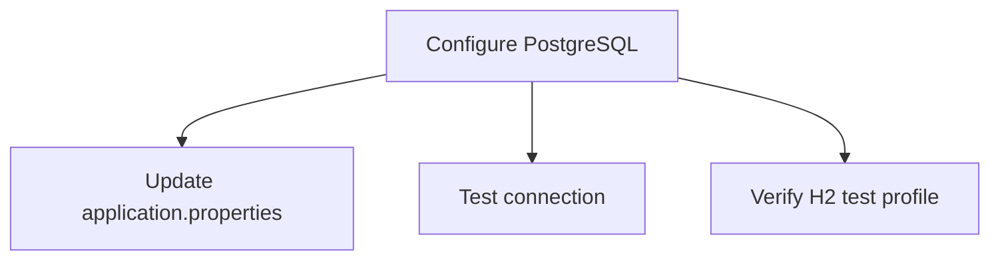
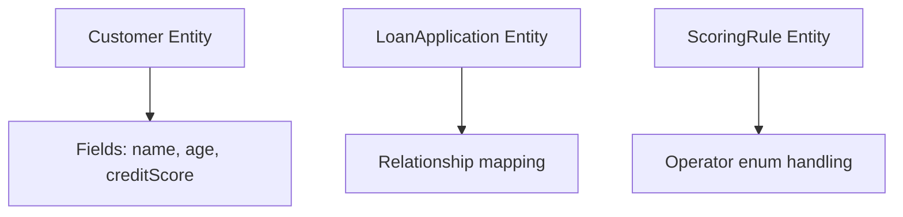
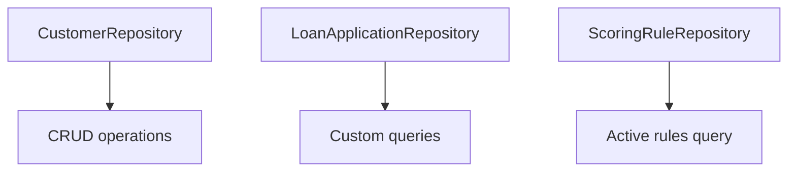

# Loan Risk Engine Implementation Plan

## Phase 1: Database Configuration


### Tasks:
1. Update `src/main/resources/application.properties` with:
   ```properties
   spring.datasource.url=jdbc:postgresql://localhost:5432/postgres
   spring.datasource.username=postgres
   spring.datasource.password=password
   spring.jpa.hibernate.ddl-auto=update
   ```
2. Create test profile configuration
3. Add database migration scripts

**Test Command:**  
`./mvnw test -Dtest=DatabaseConnectionTest`

---

## Phase 2: Entity Implementation


### Tasks:
1. Implement `Customer` entity with JPA annotations
2. Create `LoanApplication` entity with `@ManyToOne` relationship
3. Define `ScoringRule` entity with `enabled` flag

**Test Command:**  
`./mvnw test -Dtest=EntityValidationTest`

---

## Phase 3: Repository Layer


### Tasks:
1. Create Spring Data repositories
2. Add `findActiveRulesByPriorityDesc()` method
3. Implement audit fields with `@CreatedDate`

**Test Command:**  
`./mvnw test -Dtest=RepositoryIntegrationTest`

---

[Additional phases follow the same pattern...]

## Testing Strategy
| Test Type              | Scope                  | Tools Used         |
|------------------------|------------------------|--------------------|
| Unit Tests             | Service layer          | JUnit, Mockito     |
| Integration Tests      | API endpoints          | TestRestTemplate   |
| Database Tests         | Migration scripts      | Flyway, H2         |
| Performance Tests      | Concurrent evaluations | JMeter             |