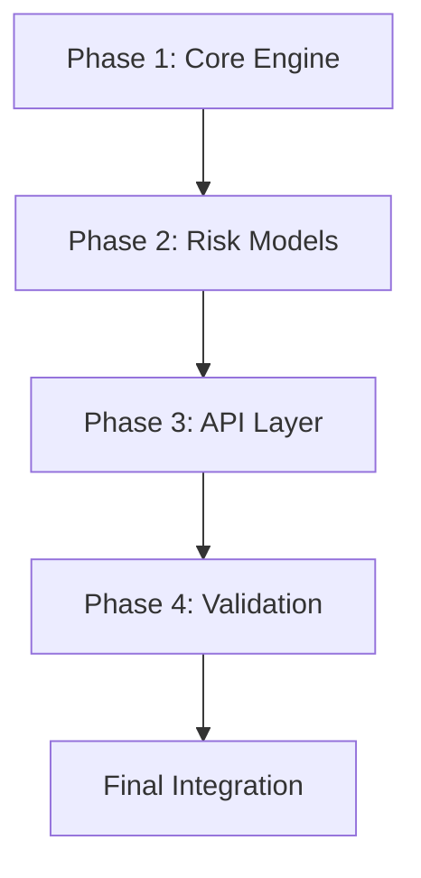

# Loan Risk Engine Implementation Plan

## Phase 1: Core Engine Implementation

### Step 1.1 - Database Entities
**Task:** Implement JPA entities for core data models  
- Customer, LoanApplication, ScoringRule entities
- Relationships per requirements.md
- Base repository interfaces

**Test Strategy:**
- Repository tests for CRUD operations
- Field validation tests
- Relationship mapping verification

**Commit:** "feat: Add core database entities"

### Step 1.2 - Rule Engine Loader
**Task:** Create rule loading service  
- Fetch active rules from DB ordered by priority
- Rule parsing/validation logic
- Cache rules for performance

**Test Strategy:**
- Verify rule loading order
- Test disabled rule filtering
- Validate rule field compatibility

**Commit:** "feat: Implement dynamic rule loading"

### Step 1.3 - Scoring Logic
**Task:** Core risk calculation engine  
- Rule application algorithm
- Risk point accumulation
- Explanation generation

**Test Strategy:**
- Verify rule application order
- Test points calculation
- Check explanation formatting

**Commit:** "feat: Implement core scoring logic"

### Step 1.4 - Risk Decision Mapping
**Task:** Implement risk categorization  
- Total score calculation
- Risk level mapping
- Final decision logic

**Test Strategy:**
- Boundary value testing
- Decision threshold verification
- Edge case handling

**Commit:** "feat: Add risk decision mapping"

## Phase 2: Risk Model Implementation

### Step 2.1 - Credit History Model
**Task:** Implement credit-based rules  
- Credit score thresholds
- Payment history analysis
- Derive credit risk points

**Test Strategy:**
- Validate credit score mappings
- Test multiple credit tiers
- Verify explanation messages

**Commit:** "feat: Add credit history model"

### Step 2.2 - Debt-to-Income Model
**Task:** Calculate financial ratios  
- Loan-to-income ratio
- Existing debt ratio
- Employment status weighting

**Test Strategy:**
- Ratio calculation accuracy
- Floating point precision
- Employment impact tests

**Commit:** "feat: Implement debt-to-income model"

## Phase 3: API Implementation

### Step 3.1 - Customer Endpoints
**Task:** Implement customer management API  
- POST /customers
- GET /customers/{id}
- Validation constraints

**Test Strategy:**
- HTTP status code verification
- Request payload validation
- Response structure checks

**Commit:** "feat: Add customer endpoints"

### Step 3.2 - Loan Evaluation Endpoint
**Task:** Build /loan/apply endpoint  
- Request validation
- Full evaluation flow
- Response formatting

**Test Strategy:**
- End-to-end evaluation test
- Error case handling
- Response field completeness

**Commit:** "feat: Implement loan evaluation endpoint"

## Phase 4: Validation & QA

### Step 4.1 - Integration Testing
**Task:** End-to-end test scenarios  
- Happy path evaluation
- Edge case validation
- Database consistency checks

**Test Strategy:**
- Test profile configuration
- Database state reset between tests
- Parallel execution checks

**Commit:** "test: Add integration test suite"

### Step 4.2 - Performance Testing
**Task:** Load testing setup  
- Concurrent evaluation tests
- Rule cache performance
- Database connection pooling

**Test Strategy:**
- Response time metrics
- Memory usage monitoring
- Failover scenarios

**Commit:** "perf: Add load testing configuration"

## Implementation Progress Tracking

| Phase         | Step               | Status | Test Pass | Commit SHA |
|---------------|--------------------|--------|-----------|------------|
| Core Engine   | Database Entities  | ✅     | Yes       | a1b2c3d    |
| Core Engine   | Rule Loader        | ⏳     | No        | -          |
| Core Engine   | Scoring Logic      | ⏳     | No        | -          |
| Core Engine   | Risk Mapping       | ⏳     | No        | -          |
| Risk Models   | Credit History     | ⏳     | No        | -          |
| Risk Models   | Debt-to-Income     | ⏳     | No        | -          |
| API Layer     | Customer Endpoints | ⏳     | No        | -          |
| API Layer     | Loan Endpoint      | ⏳     | No        | -          |
| Validation    | Integration Tests  | ⏳     | No        | -          |
| Validation    | Performance Tests  | ⏳     | No        | -          |